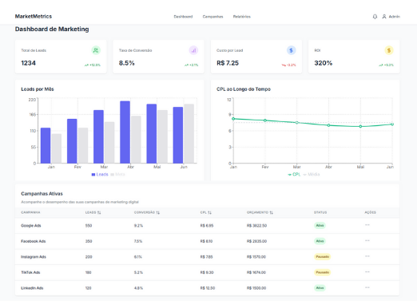

# 📊 Dashboard de Marketing Digital

Um painel de controle moderno para acompanhamento de métricas de marketing digital, como número de leads, taxa de conversão e custo por lead (CPL).

## 🚀 Tecnologias utilizadas

- [Next.js](https://nextjs.org/) - Framework React com App Router
- [Tailwind CSS](https://tailwindcss.com/) - Framework CSS utilitário
- [Recharts](https://recharts.org/) - Biblioteca de gráficos para React
- [Lucide React](https://lucide.dev/) - Ícones modernos e consistentes

## 🎯 Funcionalidades

- Visualização de métricas principais (Total de Leads, Taxa de Conversão, CPL, ROI)
- Gráfico de barras: Leads por Mês com comparação de metas
- Gráfico de linhas: Evolução do CPL ao longo do tempo
- Tabela de campanhas ativas com ordenação
- Layout 100% responsivo
- Menu mobile para dispositivos pequenos

## 📸 Demonstração

[](https://marketmetrics.netlify.app/)

## 🔧 Como executar o projeto

```bash
# Clone o repositório
git clone https://github.com/seu-usuario/dashboard-marketing.git

# Acesse a pasta
cd dashboard-marketing

# Instale as dependências
npm install

# Inicie o projeto
npm run dev