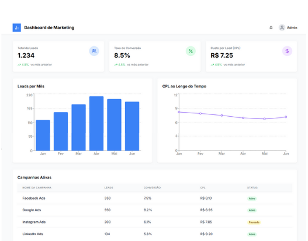

# Dashboard de Marketing

Um dashboard de marketing simplificado construído com Next.js, TailwindCSS e Recharts para visualização rápida de métricas de marketing como leads, conversões e campanhas.



## 📊 Funcionalidades

- **Métricas Principais**: Visualização rápida de Total de Leads, Taxa de Conversão e CPL
- **Gráficos de Desempenho**: 
  - Gráfico de barras para Leads por Mês
  - Gráfico de linha para CPL ao longo do tempo
- **Tabela de Campanhas**: Lista de campanhas ativas com métricas relevantes
- **Design Responsivo**: Interface adaptável para desktop e dispositivos móveis
- **Dados Mockados**: Dados de exemplo para demonstração

## 🛠️ Tecnologias Utilizadas

- **[Next.js](https://nextjs.org/)**: Framework React com App Router
- **[TailwindCSS](https://tailwindcss.com/)**: Framework CSS para estilização
- **[Recharts](https://recharts.org/)**: Biblioteca para criação de gráficos
- **[Lucide React](https://lucide.dev/)**: Ícones modernos e personalizáveis

## 📁 Estrutura do Projeto

```
/app
  /page.tsx         # Página principal do dashboard
  /layout.tsx       # Layout da aplicação
/components
  /header.tsx       # Cabeçalho com logo e menu
  /footer.tsx       # Rodapé da aplicação
  /metric-card.tsx  # Componente para exibir métricas principais
  /leads-chart.tsx  # Gráfico de barras para leads por mês
  /cpl-chart.tsx    # Gráfico de linha para CPL ao longo do tempo
  /campaigns-table.tsx # Tabela de campanhas ativas
/lib
  /mock-data.ts     # Dados mockados para o dashboard
```

## 🚀 Instalação

1. Clone o repositório:
   ```bash
   git clone https://github.com/seu-usuario/dashboard-marketing.git
   cd dashboard-marketing